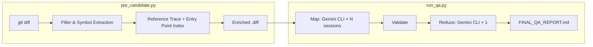
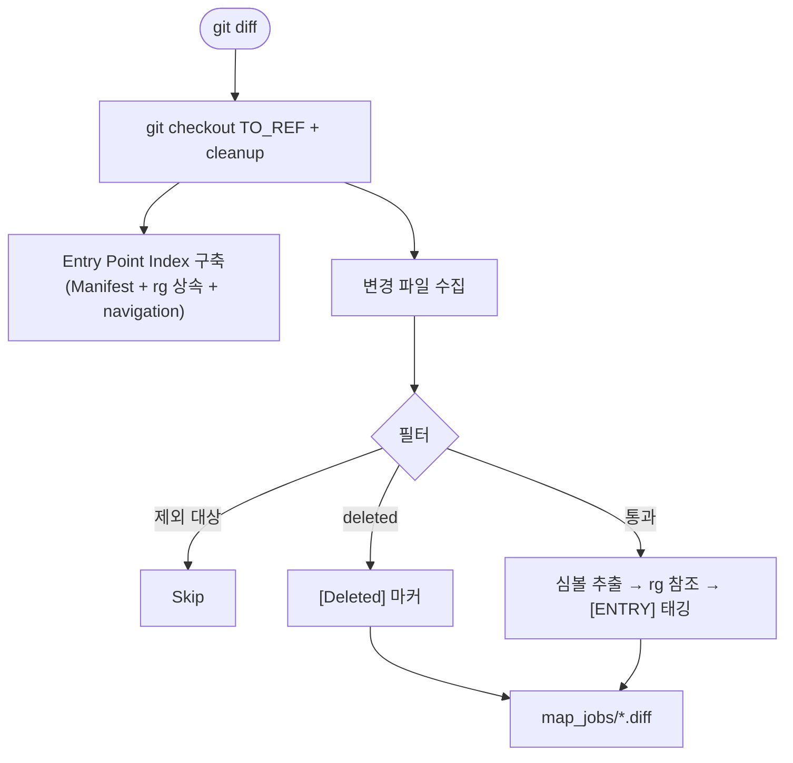
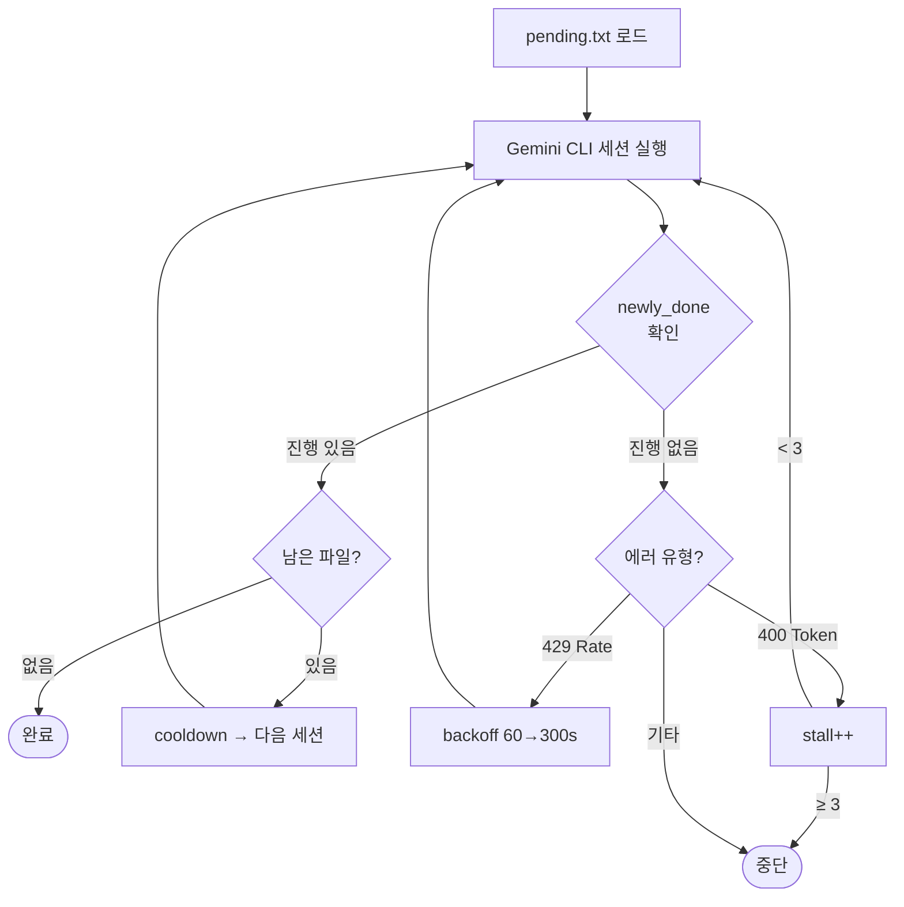
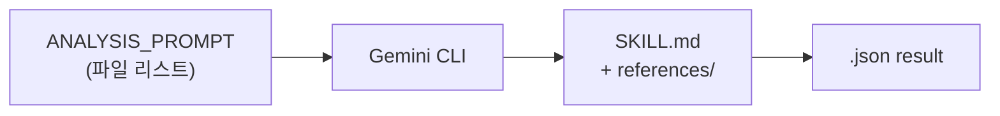

# QA Tracer Pipeline

Git diff 기반 자동 QA 분석 파이프라인. 변경된 코드의 진입점, 트리거, 위험도, 테스트 시나리오를 자동 도출합니다.

## Architecture



## Quick Start

```bash
# 1. Preprocess
python3 pre_candidate.py <FROM_REF> <TO_REF>

# 2. Analyze + Report
python3 run_qa.py
```

## Pipeline Detail

### Phase 1: Preprocess (`pre_candidate.py`)

변경 파일별 컨텍스트를 전처리하여 AI의 토큰 소비를 최소화합니다.



#### File Exclusion Rules

**A. git diff 단계 제외** (`EXCLUDES`) — diff 자체를 생성하지 않음:

| 패턴 | 이유 |
|------|------|
| `*.png`, `*.jpg` | 바이너리 이미지 |
| `*.jar`, `*.aar` | 컴파일된 라이브러리 |
| `**/build/**` | 빌드 산출물 |
| `**/strings.xml`, `**/colors.xml` | 리소스 (코드 로직 아님) |

**B. Non-production 소스셋 제외**:

| 경로 패턴 | 이유 |
|-----------|------|
| `/benchmarkShared/`, `benchmark/` | 벤치마크 |
| `/androidTest/`, `/src/test/` | 테스트 |
| `/testShared/`, `/testFixtures/` | 테스트 공유 코드 |

**C. Diff 내용 기반 제외**:

| 조건 | 기준 |
|------|------|
| Trivial | import, 주석, 공백만 변경 |
| Large | 3000줄 초과 (`MAX_DIFF_LINES`) — 토큰 초과 시 자동 skip & 재시도 |

**D. Noise Symbol 필터** — 심볼 추출 시 제외 (150+개):

| 카테고리 | 예시 |
|----------|------|
| Kotlin/Java 기본 타입 | `String`, `Int`, `Boolean`, `List`, `Map` |
| Android Framework | `Context`, `Intent`, `View`, `RecyclerView` |
| Jetpack | `LiveData`, `ViewModel`, `Flow`, `Composable` |

**E. rg 검색 제한**:

| 제한 | 값 | 목적 |
|------|-----|------|
| `--max-filesize` | 500KB | 대형 파일 건너뜀 (실측 P99=37KB, Max=232KB) |
| `--max-count` | 5 | 파일당 최대 매칭 수 |
| `RG_TIMEOUT` | 10초 | 응답 없으면 skip |
| `MAX_REFS_PER_SYMBOL` | 10 | 초과 시 common utility로 분류 |

#### Entry Point Index 구축

| 소스 | 방법 | 추출 대상 |
|------|------|-----------|
| `AndroidManifest.xml` | regex 파싱 | Activity, Service, Receiver, Provider |
| 소스 코드 상속 | `rg "class.*: Activity"` | Activity, Fragment, Worker, Service 등 |
| `navigation/*.xml` | regex 파싱 | Fragment destinations |

결과는 `map_jobs/entry_points.json`에 저장됩니다.

```json
{
  "AccountLockedFragment": "Fragment",
  "ActiveCallManager$ActiveCallForegroundService": "Service",
  "AddGroupDetailsActivity": "Activity",
  "BackupMessagesJob": "Worker"
}
```

#### Preprocess 출력 예시

`pre_candidate.py` 실행 후 생성되는 파일 구조:

```
map_jobs/
├── entry_points.json
├── pending.txt
├── 000_app_build.gradle.kts.diff
├── 007_app_src_main_java_org_thoughtcrime_securesms_GroupMembersDialog.java.diff
├── 024_..._ConversationSettingsFragment.kt.diff
├── 053_..._MessageTable.kt.diff
└── ... (총 143개 .diff)
```

각 `.diff` 파일의 내부 포맷 (실제 예시 — `ConversationSettingsFragment.kt`):

```
[Target File]: app/src/main/java/.../ConversationSettingsFragment.kt

[Changed Symbols]: ConversationSettingsFragmentDirections, GroupInviteSentDialog, RemoteConfig

[References]:
  ConversationSettingsFragment: (10+ references - common utility)
  ConversationSettingsFragmentDirections:
    - ./app/.../ConversationSettingsFragment.kt [ENTRY: Fragment]
  GroupInviteSentDialog:
    - ./app/.../GroupInviteSentDialog.java [ENTRY: Fragment]
    - ./app/.../AddGroupDetailsActivity.java [ENTRY: Activity]
    - ./app/.../ConversationSettingsFragment.kt [ENTRY: Fragment]
  RemoteConfig: (10+ references - common utility)

[Diff]:
diff --git a/app/src/main/.../ConversationSettingsFragment.kt b/...
index a3bd2d1dd8..008b171a76 100644
...
```

### Phase 2: Map — AI Analysis (`run_qa.py`)

Gemini CLI를 `--yolo` 모드로 실행하여 `.diff` 파일을 분석합니다.

#### Session Loop

세션이 중간에 중단되어도 전체 파일을 처리할 수 있는 자기 복구 루프입니다.



| 메커니즘 | 동작 |
|----------|------|
| 진행도 추적 | 세션 전후 `map_results/*.json` 수 비교 |
| pending.txt | 미처리 파일 저장 → 프로세스 재시작 시에도 이어서 처리 |
| stall 감지 | 연속 3회 0건 처리 시 중단 (무한 루프 방지) |
| rate/token 분리 | 429(일시적) → backoff 재시도, 400(구조적) → stall 카운트 |
| session cooldown | 세션 간 `SESSION_COOLDOWN`초 대기 (429 예방) |

#### Prompt 전략

프롬프트에는 파일 리스트만 전달하고, 분석 규칙은 Gemini CLI의 스킬 시스템에 위임합니다.



| 계층 | 파일 | 역할 |
|------|------|------|
| Prompt | `ANALYSIS_PROMPT` | 작업 지시 (파일 리스트만, ~200 tokens) |
| Skill | `SKILL.md` | 분석 규칙 + JSON 스키마 + 도구 제약 |
| References | `risk_guide.md` | 위험도 분류 기준 |
| References | `entry_point_patterns.md` | Android entry point 상속 패턴 |

#### Entry Point 탐색 (AI 3-Step)

| Step | 동작 |
|------|------|
| 1 | 전처리에서 부착된 `[ENTRY]` 태그 사용 |
| 2 | 태그 없으면 `rg -l` 반복 추적 (최대 10 depth) |
| 3 | 10 depth 초과 시 null + 리팩토링 권유 |

#### Map 출력 예시

`map_results/` 디렉토리에 diff와 1:1 대응하는 JSON이 생성됩니다.

```
map_results/
├── 000_app_build.gradle.kts.json
├── 007_..._GroupMembersDialog.java.json
├── 024_..._ConversationSettingsFragment.kt.json
└── ... (총 143개 .json)
```

실제 결과 (위 Preprocess 예시와 동일 파일):

```json
{
  "target_file": "app/src/main/java/.../ConversationSettingsFragment.kt",
  "change_summary": "내부 사용자용 새로운 알림 설정 화면(V2) 진입점 추가 및 그룹 초대 다이얼로그 표시 방식 변경",
  "risk_level": "MEDIUM",
  "trigger_point": "UI(Conversation Settings > Sounds and notifications / Group Invite)",
  "entry_point_file": "app/src/main/java/.../ConversationSettingsFragment.kt",
  "test_method": [
    "내부 사용자로 설정된 경우 알림 설정 진입 시 V2 화면으로 이동하는지 확인",
    "그룹 초대 발송 시 GroupInviteSentDialog가 정상적으로 나타나는지 확인"
  ],
  "confirmed_facts": [
    "RemoteConfig.internalUser 값에 따른 알림 설정 화면 이동 분기 구현",
    "GroupInviteSentDialog 호출을 정적 메서드에서 Fragment.show() 기반으로 변경"
  ],
  "trace_aborted": false,
  "abort_reason": null
}
```

#### JSON Output Schema

| 필드 | 타입 | Nullable | 설명 |
|------|------|----------|------|
| `target_file` | string | No | 변경된 파일 경로 |
| `change_summary` | string | No | 변경 내용 요약 |
| `risk_level` | string | No | CRITICAL / HIGH / MEDIUM / LOW |
| `trigger_point` | string | No | UI 또는 BG 트리거 |
| `entry_point_file` | string | **Yes** | Android 진입점 경로 |
| `test_method` | string[] | No | 테스트 시나리오 (1개 이상) |
| `confirmed_facts` | string[] | No | AI가 diff/rg로 확인한 사실 |
| `trace_aborted` | bool | No | 추적 중단 여부 |
| `abort_reason` | string | **Yes** | 중단 사유 |

### Phase 3: Validate (`run_qa.py`)

Reduce 전에 모든 JSON을 검증합니다.

| 체크 항목 | 내용 |
|-----------|------|
| JSON 파싱 | 유효한 JSON |
| 루트 타입 | dict 여부 |
| 필수 필드 9개 | 존재 + 타입 검증 |
| risk_level | CRITICAL/HIGH/MEDIUM/LOW 중 하나 |

Broken 파일은 로그 출력 후 리포트에서 제외됩니다.

### Phase 4: Reduce — Report Generation (`run_qa.py`)

1. **Hotspot 계산** (Python) — entry_point별 변경 파일 수 집계, 2건 이상을 hotspot으로 선정
2. **Gemini CLI 1회 호출** — 전체 JSON을 입력으로 최종 마크다운 리포트 생성

출력: `FINAL_QA_REPORT.md`

```markdown
## 추적 중단 항목
(trace_aborted=true인 파일 목록)

### Category (e.g., Background / Database)
| 확인 | 위험도 | 트리거 | 진입점 | 테스트 시나리오 | 대상 파일 |
|------|--------|--------|--------|----------------|-----------|
| [ ] | CRITICAL | BG(DB Migration) | `SignalDatabase.kt` | ... | `V304_...kt` |

### ...more categories...

## 주요 변경 집중 지점 (Entry Point Hotspots)
- **ConversationFragment.kt**: 5건 변경, 최고 위험도 HIGH
```

## File Structure

```
.
├── pre_candidate.py                    # Preprocess
├── run_qa.py                           # Map → Validate → Reduce
├── .gemini/skills/qa-tracer/
│   ├── SKILL.md                        # AI rules & JSON schema
│   └── references/
│       ├── risk_guide.md               # Risk classification
│       └── entry_point_patterns.md     # Android entry point patterns
├── map_jobs/                           # (generated) enriched .diff files
│   ├── entry_points.json              # pre-computed entry point index
│   └── pending.txt                    # remaining files for resume
├── map_results/                        # (generated) per-file .json results
└── FINAL_QA_REPORT.md                  # (generated) final QA checklist
```

## Configuration

`run_qa.py`:

| 변수 | 기본값 | 설명 |
|------|--------|------|
| `GEMINI_MODEL` | `"auto"` | Gemini 모델 선택 |
| `SESSION_COOLDOWN` | `5` | 세션 간 대기 (초, 429 예방) |
| `GEMINI_TIMEOUT` | `1800` | 세션 타임아웃 (초) |
| `NODE_HEAP_MB` | `8192` | Gemini CLI 메모리 한도 |
| `MAX_STALLS` | `3` | 진행 없는 세션 허용 횟수 |
| `MAX_RATE_RETRIES` | `5` | Rate limit 재시도 횟수 |

`pre_candidate.py`:

| 변수 | 기본값 | 설명 |
|------|--------|------|
| `MAX_DIFF_LINES` | `3000` | diff 최대 라인 수 |
| `RG_MAX_FILESIZE` | `500K` | rg 검색 대상 파일 크기 한도 |
| `MAX_REFS_PER_SYMBOL` | `10` | 심볼당 최대 참조 수 |
| `RG_TIMEOUT` | `10` | rg 타임아웃 (초) |

## Design Decisions

### Why preprocess?

전처리에서 심볼 추출, 참조 탐색, entry point 인덱싱을 완료하면:
- AI는 판단만 하면 됨 (요약, 분류, 시나리오 작성)
- 할루시네이션 감소 — 사실 기반 데이터가 미리 제공됨
- 토큰 비용 절감 — AI가 `rg`/`find`를 반복 호출할 필요 없음

### Why 10-depth entry point trace?

Android 대형 프로젝트의 호출 체인:
```
ChatArchiveExporter → extension func → Processor → Repository → BackupMessagesJob
```
2-depth로는 81%만 검출. 10-depth 초과 시 리팩토링 권유를 `abort_reason`에 포함합니다.

### Why separate rate limit from token limit?

| | Rate Limit (429) | Token Limit (400) |
|---|---|---|
| 원인 | 서버 용량 부족 (일시적) | 입력 크기 초과 (구조적) |
| 대응 | backoff 후 재시도 | stall count로 제한 |
| 같은 요청 재시도 | 성공 가능 | 실패 반복 |

## Test Results

| 항목 | 값 |
|------|-----|
| App | **Signal Android** |
| 버전 범위 | `v8.1.0` → `v8.2.0` |
| 커밋 수 | 61 commits |
| git diff 전체 변경 파일 | 300개 |
| git diff 제외 (바이너리, 리소스 등) | 137개 |
| 전처리 제외 (non-prod, trivial 등) | 20개 |
| 분석 대상 (diff 생성) | **143개** |

### 처리 현황

| 항목 | 값 |
|------|-----|
| AI 분석 완료 (json) | **143개 (100%)** |
| JSON 스키마 검증 통과 | **143개 (100%)** |
| Broken JSON | **0개** |

### 위험도 분포

| 위험도 | 건수 | 비율 |
|--------|------|------|
| CRITICAL | 3 | 2.1% |
| HIGH | 11 | 7.7% |
| MEDIUM | 33 | 23.1% |
| LOW | 96 | 67.1% |

### Entry Point 검출

| 항목 | 값 |
|------|-----|
| Entry point 검출 | 116건 (81.1%) |
| Entry point null | 27건 (18.9%) |
| Trace aborted | 27건 |
| 테스트 시나리오 생성 | **143건 (100%)** |

Entry point가 null인 27건은 주로 유틸리티 클래스, 빌드 설정, proto 파일 등 진입점 개념이 없는 파일입니다.
